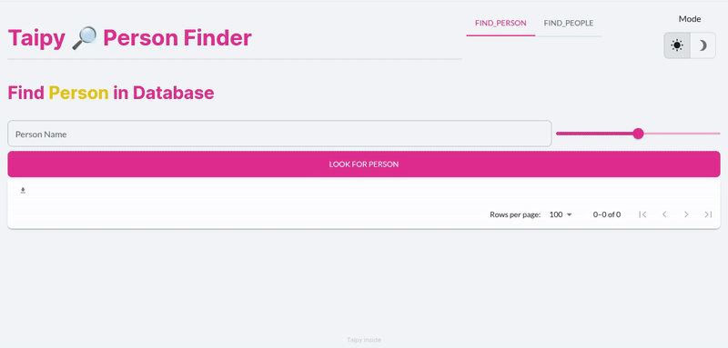
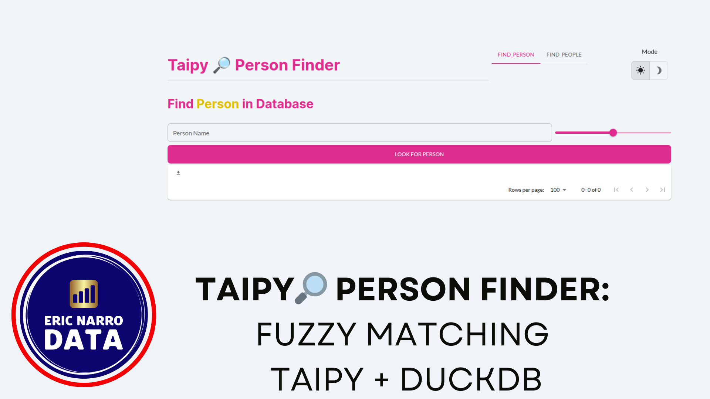

# Taipy Person Finder

[](https://github.com/psf/black)


- [Taipy Person Finder](#taipy-person-finder)
  - [App Description](#app-description)
  - [Use Cases](#use-cases)
  - [Possible Improvements](#possible-improvements)
    - [Warnings and limits on size](#warnings-and-limits-on-size)
    - [Introducing Filters](#introducing-filters)
    - [Allowing Better Inputs](#allowing-better-inputs)
  - [Running the Application](#running-the-application)
    - [Running Locally with UV](#running-locally-with-uv)
    - [Docker Image](#docker-image)
  - [Generate Fake Data](#generate-fake-data)
  - [Favicon](#favicon)
  - [Video Presentation](#video-presentation)

App that uses DuckDB and string comparison methods.

## App Description

This application simulates a company search tool, that helps workers identify people in their information system using string similarity algorthms. The main algoritm used in this application is the [Jaro-Winkler string distance](https://en.wikipedia.org/wiki/Jaro%E2%80%93Winkler_distance).  

The application has two tabs. One tab lets users introduce a name (first name followed by family name) and look for the person in a parquet file that simulates the company's information system. The second tab lets users upoad a file, that can be a CSV or parquet file, and look for all similar strings in the information system (using a `CROSS JOIN`).

In both tabs, users can select a threshold value for the score similarity, between 0.8 and 1 (where 1 is an exact match).

String similarity algorithms are computationally expensive and Python is notoriously slow for string comparison tasks. **Using DuckDB allows to get the speed from its C++ engine**. This is a technique that fits in a batch process as well, but that will be for another project!



## Use Cases

Imagine a company that needs to identify people in their information system. They may have a list of people coming from a government agency, for compliance reasons. Or the list may come from a rejection process (imagine a database process that didn't find an exact match on id or other field).

A few reasons make exact name match difficult:

- Typos during form filling.
- Names may have variants, imagine "Eric" vs. "Erick" vs. "Erik"; or "Mohammed" vs. "Muhammad" vs "Mohammad". This is a common case.
- Inversion of first and last name.

Using a string similarity algorithm, the company can identify possible matches from the list, in their information system. This would be the first step of a process, since proper identification would require manual validation.

## Possible Improvements

This application is a Proof Of Concept (POC) which I can enhance. Maybe I'll do that one day. The following are some ideas to improve it.

### Warnings and limits on size

I could add some notification warnings in case of large file input. Since the app performs a `CROSS JOIN`, this may take forever. I've tested a `50.000 x 50.000` lines operation, which amounts to 2.5 Billion rows , and it took a few minutes to perform the calculation, in a 16 GB memory laptop.

### Introducing Filters

In a company situation, we could introduce filters to restrict the comparison. We could compare certain subsets, for example, if we know we're looking for a woman, then filter all men out (this would increase speed and return more relevant results). Or filter by age (let's say, we're looking for retirred people).

### Allowing Better Inputs

Right now, the app accepts parquet and CSV files, but it assumes that CSV files are comma-separated. Adding a separator check to use the appropriate method would be interesting.

## Running the Application

### Running Locally with UV

I used [uv](https://docs.astral.sh/uv/) as environment manager to create this app. The app has a `pyproject.toml` file, you can create the virtual environment with:

```bash
uv sync
```

Next, you can run the application with:

```bash
uv run --directory src main.py
```

### Docker Image

The app provides a dockerfile. You can create an image with the following command (here, `finder-image` is the image name, you can give it any other name):

```bash
docker build -t finder-image .
```

## Generate Fake Data

The application uses fake data, since it's a POC. I used [Faker](https://pypi.org/project/Faker/) to generate it.

I created a notebook with [Marimo](https://pypi.org/project/marimo/). The reason of this choice is that I wanted to test it!

```bash
uv run --directory create_data marimo edit create_fake_data.py
```

## Favicon

The favicon comes from [favicon.ico](https://favicon.io/), check them out!

## Video Presentation

Here's a video presentation of the application (quality isn't good, I'll try to work on that for other times):

[](https://youtu.be/AG90R9X45nQ)
